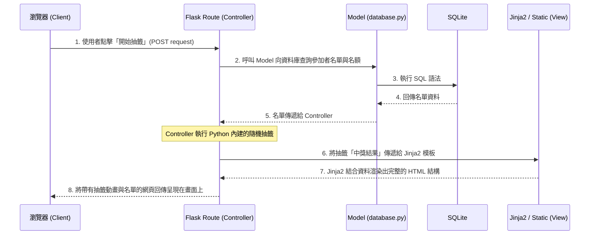

# 系統架構設計：線上抽籤系統

本文件基於 PRD 內容，定義了線上抽籤系統的技術架構與資料夾結構。

## 1. 技術架構說明

為了達到「簡單直覺」以及「快速建置」的目標，我們採用輕量且成熟的技術棧：

### 選用技術與原因
- **後端：Flask (Python)** — 輕量化、易於上手，非常適合不需要過度複雜依賴的小型/微型 Web 應用。
- **模板引擎：Jinja2** — Flask 內建支援的模板系統，可以直接在 HTML 中寫入 Python 變數與簡單邏輯，不用額外建置繁重的前端框架。
- **資料庫：SQLite** — 無需架設獨立的資料庫伺服器，資料直接存在本地檔案中，非常適合中小型資料量與低度併發的抽籤系統。

### MVC 架構模式下的各司其職
在本專案中，我們採用傳統的 MVC（Model-View-Controller）模式，但結合 Flask 的特性做了微調，使其不過度分離：

* **Model (資料模型)**：位於 `models` 資料夾與 `instance` 資料夾中。負責和 SQLite 資料庫溝通，處理「抽籤活動的存取」、「抽出結果的紀錄」等與資料有關的邏輯。
* **View (視圖)**：位於 `templates`（HTML）與 `static`（CSS/JS）資料夾中。負責呈現給使用者的介面，包含表單、抽籤動畫、結果清單。
* **Controller (控制器)**：位於 `routes` 資料夾與 `run.py`。負責接收使用者的網頁請求（如：點擊開始抽籤），跟 Model 要名單資料，執行抽籤的核心邏輯後，把結果塞進給 View 進行渲染。

---

## 2. 專案資料夾結構

建議的資料夾結構與相對應的用途，可以幫助我們後續順利地開發。

```text
web_app_development/
├── app/                      ← 專案主程式的封裝
│   ├── __init__.py           ← 初始化 Flask App 的地方
│   ├── models/               ← 【Model 層】各種操作資料庫的 Python 檔案
│   │   └── database.py       ← SQLite 連線與基本 CRUD 腳本
│   ├── routes/               ← 【Controller 層】定義每個網址對應哪些 Python 函式
│   │   └── draw_routes.py    ← 像是 /create, /draw 的路由控制
│   ├── templates/            ← 【View 層】Jinja2 的 HTML 模板
│   │   ├── base.html         ← 共同的網頁框架 (Header, Footer)
│   │   ├── index.html        ← 首頁：填寫活動資訊與名單
│   │   ├── result.html       ← 抽籤結果與歷史紀錄頁面
│   └── static/               ← 【View 層】不被動態編譯的靜態資源檔
│       ├── style.css         ← 樣式設計 (視覺美化)
│       └── draw_anim.js      ← 抽籤時畫面的滾動過場動畫邏輯
├── instance/                 
│   └── app.db                ← 最終自動長出來的 SQLite 資料實體檔案
├── docs/                     
│   ├── PRD.md                ← 產品需求文件
│   └── ARCHITECTURE.md       ← 系統架構設計文件 (本文件)
├── requirements.txt          ← 專案安裝的 Python 套件記錄
└── run.py                    ← 啟動整個應用的入口點
```

---

## 3. 元件關係 (Flask / Jinja2 / SQLite 協作圖)

利用簡單的流程，說明這三個核心技術是如何運作的。



---

## 4. 關鍵設計決策

1. **路由抽離避免臃腫**
   隨著應用程式擴展，全部把程式寫在 `app.py` 中會使得檔案過於冗長。因此設計了 `app/routes/` 資料夾，利用 Flask 的 `Blueprint` 功能來將路由分散管理。
2. **非前後端完全分離（伺服器端渲染 Server-Side Rendering）**
   抽籤系統的邏輯不複雜。比起使用 React 或 Vue.js 開發分離的專案並串接 API，在這裡改用 Jinja2 從伺服器端直接生成完整 HTML，可以大幅縮短產品開發時間並維持應用程式輕量化。
3. **JS 負責小動畫，抽籤邏輯保留在後端**
   抽籤的「隨機」演算法必須在後端計算並產生以維持公平性（避免在前端可以被竄改結果），而 `draw_anim.js` 僅負責在畫面收到結果前展現轉盤或跳動數字等「視覺特效」。
