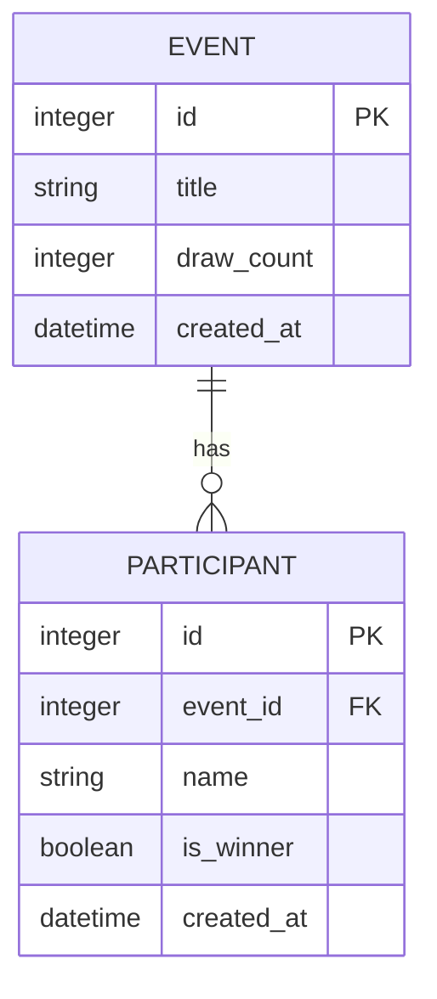

# 資料庫設計 (Database Design)

本文件根據 PRD 與系統架構需求，定義「線上抽籤系統」的資料庫結構。我們採用 SQLite 作為資料庫儲存方案。

## ER 圖 (實體關係圖)

## 資料表詳細說明

### 1. `events` (活動資料表)
記錄每次發起的抽籤活動基本資訊。

| 欄位名稱 | 型別 | 必填 | 說明 |
| --- | --- | --- | --- |
| `id` | INTEGER | 是 | Primary Key，自動遞增。活動的唯一識別碼。 |
| `title` | TEXT | 是 | 活動名稱或主題說明。 |
| `draw_count` | INTEGER | 是 | 預計抽出的中獎人數。 |
| `created_at` | DATETIME | 是 | 活動建立的時間（預設為系統當下時間）。 |

### 2. `participants` (參加者資料表)
記錄每一位參與該抽籤活動的參與者名單，以及抽籤的結果（是否中籤）。

| 欄位名稱 | 型別 | 必填 | 說明 |
| --- | --- | --- | --- |
| `id` | INTEGER | 是 | Primary Key，自動遞增。參加者的唯一識別碼。 |
| `event_id` | INTEGER | 是 | Foreign Key，對應到 `events` 表格的 `id`。 |
| `name` | TEXT | 是 | 參加者的姓名。 |
| `is_winner` | INTEGER | 是 | 是否中籤：`1` 代表中籤，`0` 代表未中籤。 |
| `created_at` | DATETIME | 是 | 記錄建立的時間（預設為系統當下時間）。 |

## SQL 建表語法

請參考 `database/schema.sql` 檔案。

## Python Model 程式碼

我們採用原生的 `sqlite3` 模組來操作資料庫，對應的檔案皆位於 `app/models/` 目錄中：
- `database.py`: 負責與 SQLite (`instance/app.db`) 的連線獲取與初始化。
- `event.py`: 封裝 `Event` 相關的 CRUD 操作。
- `participant.py`: 封裝 `Participant` 相關的 CRUD 操作。
