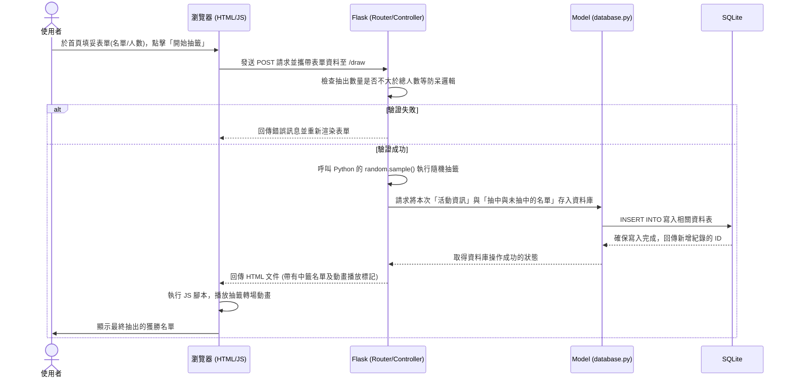

# 流程圖設計：線上抽籤系統

這份文件基於產品需求 (PRD) 與系統架構 (ARCHITECTURE) 進行視覺化的流程設計。包含了使用者操作的旅程，以及後方系統是如何互動儲存資料的流程。

## 1. 使用者流程圖 (User Flow)

這張圖呈現了使用者造訪網站後，經過哪些畫面，可能會遇到哪些分支與操作選項。
透過這張圖，開發者與設計師能清楚判斷是否有遺漏的保護機制或錯誤處理。

```mermaid
flowchart TD
    A([使用者造訪系統]) --> B[首頁 - 抽籤活動設定]
    B --> C[輸入活動名稱]
    C --> D[貼上參加者名單]
    D --> E[設定抽出數量]
    E --> F[點擊「開始抽籤」]
    
    F --> G{系統驗證資料合法性}
    G -->|數量大於總人數或名單空白| H[畫面跳轉：顯示錯誤提示語]
    H --> B
    
    G -->|驗證成功與後端儲存完畢| I[進入抽籤結果頁面 (資料已存入)]
    I --> J[播放抽籤滾動動畫]
    J --> K[動畫結束：浮現最終中籤名單]
    
    A --> M[也可以選擇點擊「歷史紀錄」]
    M --> N[檢視過往所有的抽籤結果與中獎名單]
    K -.-> N
```

---

## 2. 系統序列圖 (Sequence Diagram)

這張序列圖深入探討當使用者「點擊開始抽籤」送出表單後，在系統內部，瀏覽器、Flask 後端、資料操作 Model 與 SQLite 資料庫之間發生了什麼對話。



---

## 3. 功能清單與路由對照表

這是統整前後端對接的網址結構，幫助我們在下一步進入實作或 API 設計階段時有所依循。

| 功能名稱 | 說明 | HTTP 路由 (URL) | 方法 (Method) |
| --- | --- | --- | --- |
| **首頁與表單** | 呈現填寫抽籤資訊的介面 | `/` | `GET` |
| **執行抽籤** | 接收表單、驗證、計算抽籤結果、存 DB 並回傳畫面 | `/draw` | `POST` |
| **歷史紀錄列表** | 列出過去所有建立過的抽籤活動 | `/results` | `GET` |
| **單一活動結果** | 檢視某一次特定活動（由 ID 指定）的完整名單 | `/results/<int:id>` | `GET` |
